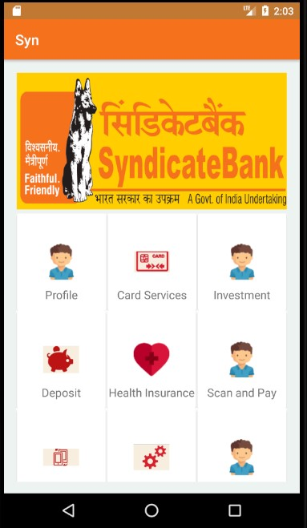
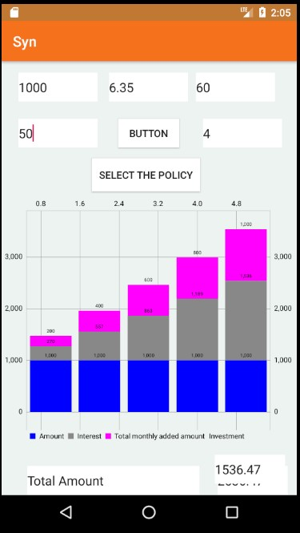
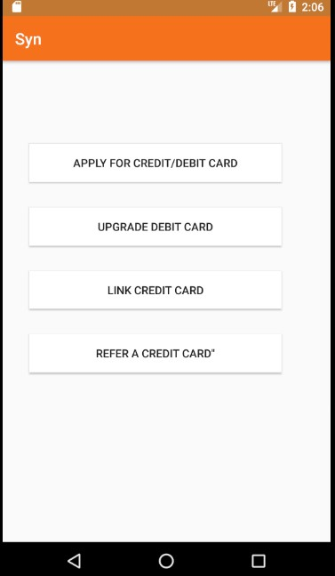
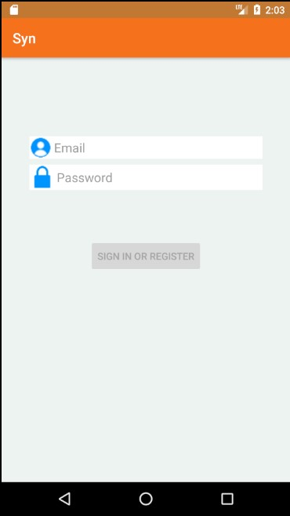

</p>
<h1 align = 'center'>Banking App GUI</h1>
<br>


</p>

## Description ##
<p>
GUI for a banking app.
</p>








## Link to Working Demo of the game ##
<a href="https://drive.google.com/file/d/12ygq0Bl6YTbB1GKVLgGqBxvAjmMbXIz7/view">
Top-Down-Shooter
</a>
<br>

#### How to Run- 

```html
Download the executable file in the exe folder and run
```

###             Tech stack
`Implemented on` : Unity  <br>
`Language` : C# <br>
`Game Art` : Photoshop  <br>

<h3 align="center"><b>Developed with :heart: by <a href="https://github.com/tarush-r">Tarush</a> ,<a href="https://github.com/sakship31/">Sakshi</a> and <a href="https://github.com/sanmitsahu/">Sanmit</a></b></h1>
